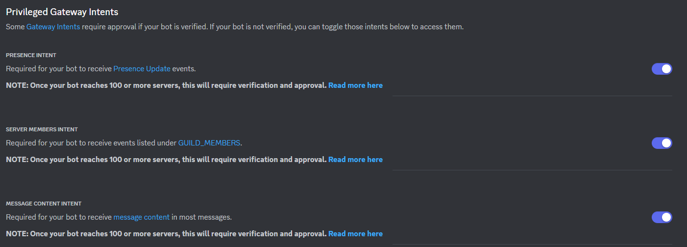

# About
Hello there! This is a template for an [Eris.js](https://abal.moe/Eris/) based Discord Bot. Note this is not an official template and is not associated with the Eris team.

Features include:
* Event Handler
* Command Handler
* 2 Sample Commands
* 1 Sample Event

# Setup

First, setup a new Discord Bot at the [Discord Developer Portal](https://discord.com/developers/applications). Make sure to enable gateway intents and add the bot to your server(s). Also make sure to reset the token and copy the new one. 

  

Next, clone this repo or download the files manually. Once that is done make sure to replace the token in the [.env](.env) file with the one you obtained while seting up the bot. You can also modify the command prefix [here](index.js#33).

Finally, make sure to install all required dependencies by running this command:  
`npm i package-lock.json`  
Start the bot by running this command:  
`node index.js`  

